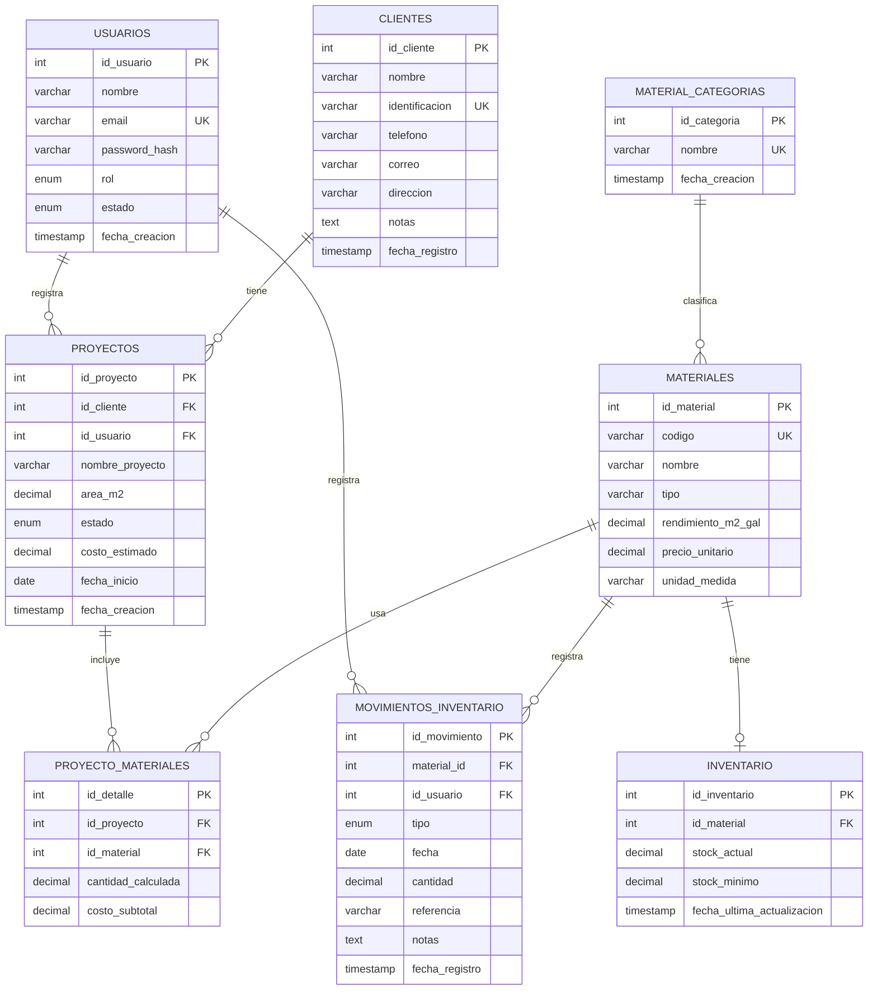

# Diagrama ER

```mermaid
erDiagram
    USUARIOS {
        int id_usuario PK
        varchar nombre
        varchar email UK
        varchar password_hash
        enum rol
        enum estado
        timestamp fecha_creacion
    }

    CLIENTES {
        int id_cliente PK
        varchar nombre
        varchar identificacion UK
        varchar telefono
        varchar correo
        varchar direccion
        text notas
        timestamp fecha_registro
    }

    PROYECTOS {
        int id_proyecto PK
        int id_cliente FK
        int id_usuario FK
        varchar nombre_proyecto
        decimal area_m2
        enum estado
        decimal costo_estimado
        date fecha_inicio
        timestamp fecha_creacion
    }

    MATERIALES {
        int id_material PK
        varchar codigo UK
        varchar nombre
        varchar tipo
        decimal rendimiento_m2_gal
        decimal precio_unitario
        varchar unidad_medida
    }

    MATERIAL_CATEGORIAS {
        int id_categoria PK
        varchar nombre UK
        timestamp fecha_creacion
    }

    INVENTARIO {
        int id_inventario PK
        int id_material FK
        decimal stock_actual
        decimal stock_minimo
        timestamp fecha_ultima_actualizacion
    }

    MOVIMIENTOS_INVENTARIO {
        int id_movimiento PK
        int material_id FK
        int id_usuario FK
        enum tipo
        date fecha
        decimal cantidad
        varchar referencia
        text notas
        timestamp fecha_registro
    }

    PROYECTO_MATERIALES {
        int id_detalle PK
        int id_proyecto FK
        int id_material FK
        decimal cantidad_calculada
        decimal costo_subtotal
    }

    USUARIOS ||--o{ PROYECTOS : registra
    USUARIOS ||--o{ MOVIMIENTOS_INVENTARIO : registra
    CLIENTES ||--o{ PROYECTOS : tiene
    PROYECTOS ||--o{ PROYECTO_MATERIALES : incluye
    MATERIALES ||--o{ PROYECTO_MATERIALES : usa
    MATERIALES ||--o| INVENTARIO : tiene
    MATERIALES ||--o{ MOVIMIENTOS_INVENTARIO : registra
    MATERIAL_CATEGORIAS ||--o{ MATERIALES : clasifica
```
